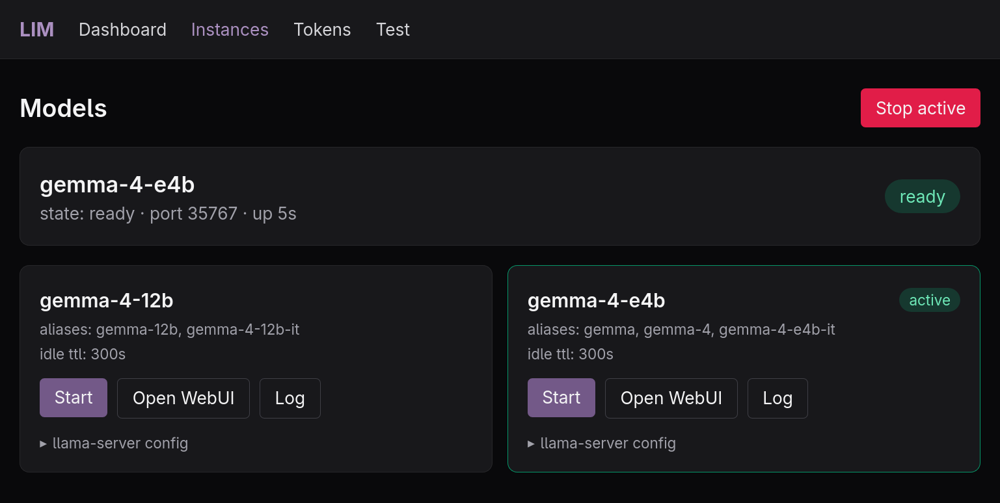
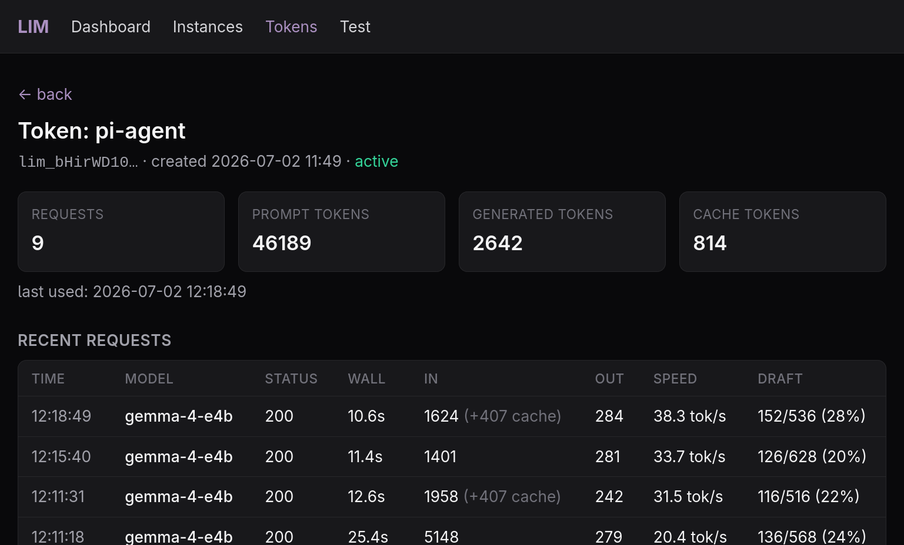

# local-inference-manager (lim)

> [!WARNING]
> **WORK IN PROGRESS**
> Alternative to [llama-swap](https://github.com/mostlygeek/llama-swap)

- Are you tired of keeping 20 different llama-server configs and scripts?
- Would you like to share access to your local models with friends and colleges, but in a controlled way?
- Do you happen to be a member of the permanent underclass (less than 500GB VRAM)?
- Would you like to keep different models ready to load on demand and have them unload after some idle time? 

## couple images:

On demand instance start and stop with full log and proxied llama-server webui:




Global or per Auth Token stats, traces and logs: 



## Features:

- prometheus exporter with llama-server instance metrics aggregation (and some new global ones) 
- full llama-server stop on instance idle (actually clears vram and allows your GPU to sleep)
- on demand instance start, no need to send an extra start request
- auth tokens with per token logs & metrics
- config has zero abstraction, all llama-server args are visible. you can use your existing configs
- on demand model downloads handled by llama-server, no useless lock-in stuff 
- supports multiple alias names for your models
- run with `--show-llama-logs` to get the full llama-server logs to stdout, nothing is hidden


## Config format: 

Please check [example config](./config.example.yaml) for more details.

Here is a config for qwen3.6 27b, as you can see this project is truely just a manger and doesnt try to replace anything:

```
models:
  qwen3.6-27b:
    cmd: |
      /app/llama-server
      --host 127.0.0.1
      --port ${PORT}
      -ngl 99
      --jinja
      --metrics
      -fa on
      --cache-type-k q8_0
      --cache-type-v q8_0
      --cache-reuse 256
      --no-mmap
      --spec-type draft-mtp
      -hf unsloth/Qwen3.6-27B-MTP-GGUF:Q4_K_M
      --spec-draft-n-max 2
      --ctx-size 131072
      --temp 0.6
      --top-p 0.95
      --top-k 20
      --min-p 0
      --repeat-penalty 1
    ttl: 300
    aliases:
      - qwen
      - qwen3.6
      - qwen3.6-27b-mtp
```
